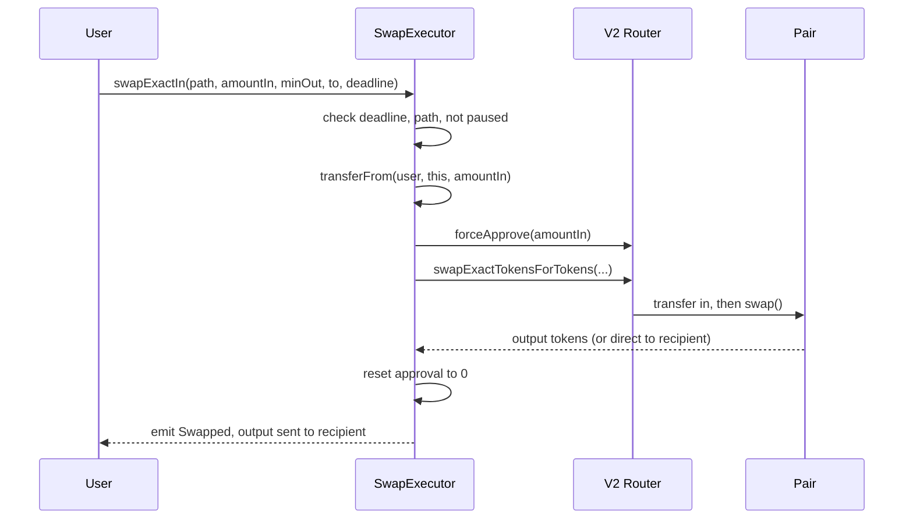
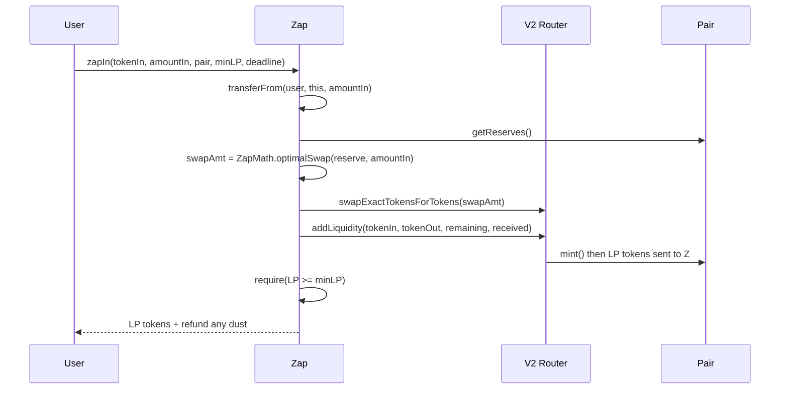
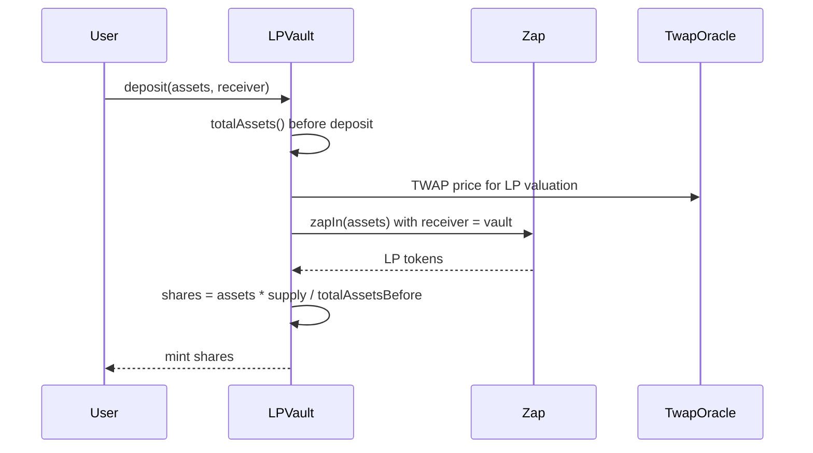
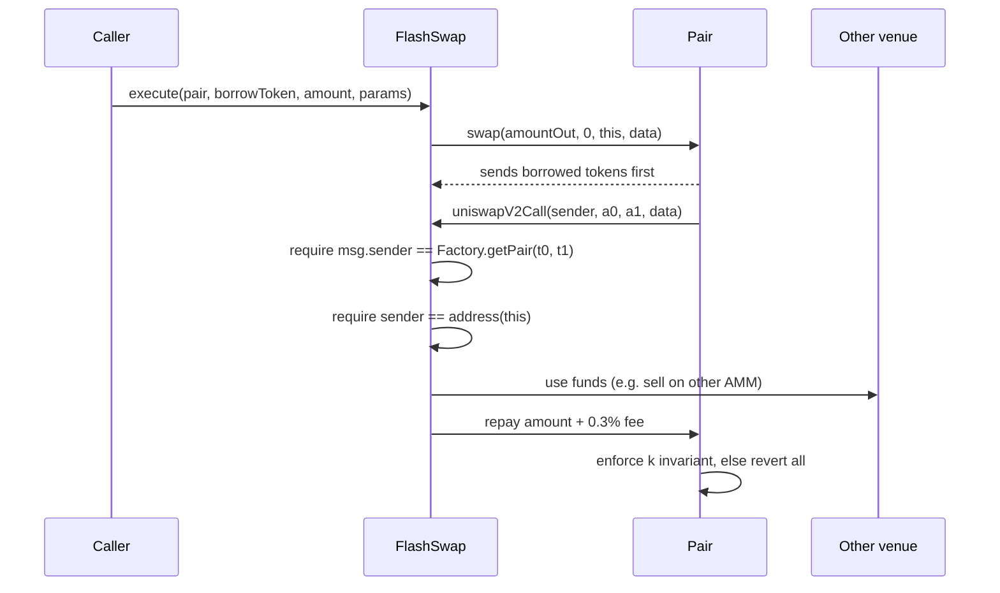
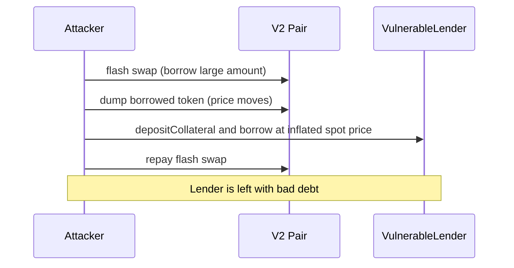

# V2 Zap & Vault: Technical Architecture and Tech Stack

**Version:** 1.0 | **Depends on:** 01-PRD | **Feeds:** 03-Contract Specs

---

## 1. Architecture Principles

These six rules drive every design choice below. When two options are close, pick the one that follows these.

1. **Stateless periphery.** SwapExecutor, Zap and FlashSwap never hold user funds between transactions. Funds come in, work happens, funds go out.
2. **Integrate, don't copy.** We call the deployed Router, Factory and Pair. We write only the thin interfaces we need.
3. **Never trust spot price.** Anything that values assets uses TWAP or fair-reserves math, never raw reserves.
4. **Verify every external caller.** Callbacks check that `msg.sender` is the real pair from the Factory.
5. **Everything is tested on real state.** All tests run on a pinned mainnet fork.
6. **Small and composable.** Each contract does one job. The Vault reuses the Zap instead of duplicating its math.

---

## 2. System Context

Where our contracts sit relative to Uniswap V2 and the outside world.

```text
┌───────────────────────────── YOUR CODE ─────────────────────────────┐
│                                                                     │
│   SwapExecutor      Zap  ◄────── LPVault (ERC-4626)                 │
│        │             │                │                             │
│        │             │                └──► TwapOracle               │
│   FlashSwap          │                                              │
│        │             │        Security Lab (test-only):             │
│        │             │        VulnerableLender, Attackers, Fixes    │
└────────┼─────────────┼──────────────────────────────────────────────┘
         │             │
┌────────▼─────────────▼───────── UNISWAP V2 (deployed, untouched) ───┐
│  Router02 ──► Factory ──► Pair(s)  ──► ERC20 tokens + WETH          │
└─────────────────────────────────────────────────────────────────────┘
```

- **Actors:** an EOA user (swaps, zaps, deposits), a keeper or anyone (flash swaps), an owner (pause and rescue), and an attacker (test-only).
- **External dependencies:** Uniswap V2 (Router02, Factory, Pair), WETH9, ERC20 tokens, OpenZeppelin.
- **Trust boundary:** V2 core contracts are trusted to be correct. The *tokens* and *prices* they report are not trusted.

---

## 3. Components

| Component | Type | Holds funds? | Talks to | Responsibility |
|---|---|---|---|---|
| `SwapExecutor` | Contract | No | Router | Safe swaps: exact-in and exact-out, multi-hop, ETH |
| `Zap` | Contract | No | Router, Factory, Pair | Single token ↔ LP position |
| `LPVault` | Contract (ERC-4626) | **Yes** (LP tokens) | Zap, TwapOracle, Pair | Shares over an auto-zapped LP position |
| `FlashSwap` | Contract | No | Factory, Pair | Borrow, use, repay with fee |
| `TwapOracle` | Contract | No | Pair | Stores price observations; returns TWAP |
| `ZapMath` | Library | n/a | none | Optimal swap amount, pure math |
| `V2Library` | Library | n/a | Factory | `sortTokens`, `getAmountOut`, pair lookup (0.8-compatible) |
| Security Lab | Test-only | n/a | Pair, Oracle | `VulnerableLender`, attackers, fixed versions |

**Addition vs the PRD:** `TwapOracle` is now a real component. The Vault needs it for safe LP valuation (FR-VT-7), and the security lab needs it for the oracle fix (FR-SL-2). Building it once serves both.

---

## 4. Key Design Decisions

| # | Decision | Why | Trade-off |
|---|---|---|---|
| D1 | Write minimal local interfaces (`IUniswapV2Router02`, `IUniswapV2Pair`, `IUniswapV2Factory`) instead of importing the official packages | V2 core is Solidity 0.5/0.6 and does not compile with 0.8 | You must copy signatures carefully, and tests on a fork catch mistakes |
| D2 | Use `Factory.getPair()` for pair lookup, not CREATE2 address derivation | Simpler, works on forks of V2 with a different init code hash | Slightly more gas |
| D3 | Zap and SwapExecutor call the **Router**; FlashSwap talks to the **Pair** directly | Router gives deadline, path and safety checks; flash swaps are only possible at the Pair | Two integration styles to learn, which is the point |
| D4 | LPVault **calls Zap as an external contract** (receiver = vault) | One copy of the zap math; Zap stays independently testable | An extra approval and external call per deposit |
| D5 | Vault values LP tokens with **fair-reserves math + TWAP price** | Raw reserves can be flash-manipulated; this is the main security lesson | More code and a warm-up period for the oracle |
| D6 | Approvals use `SafeERC20.forceApprove` for the exact amount, reset to 0 after | USDT-style tokens revert when changing a non-zero allowance; no lingering allowances | Extra SSTOREs |
| D7 | ETH enters only via explicit payable functions; `receive()` accepts ETH only from WETH | Prevents accidental ETH locking | Direct ETH transfers revert, which is intended |
| D8 | Owner has **only** pause and rescue powers; no fee switch, no upgradeability | Minimal trust surface; easy to audit | Not upgradeable |
| D9 | Dedicated deposit token per vault (e.g. USDC for USDC/WETH) | Simple accounting | One vault per pair and token |

---

## 5. Call Flows

### 5.1 Swap (exact input)



### 5.2 Zap in (single token → LP)



**Zap out** is the reverse: transfer LP in, `removeLiquidity`, swap the other token into the target token, check `minAmountOut`, send out.

### 5.3 Vault deposit



`totalAssets()` = (vault LP balance valued via fair reserves at TWAP price) expressed in the deposit token. Shares are minted from the value **before** the deposit is added, which avoids dilution bugs.

### 5.4 Flash swap



### 5.5 Security lab: spot-oracle exploit (test-only)



The fixed lender reads `TwapOracle` instead, and the same sequence reverts or yields no profit.

---

## 6. Tech Stack

| Layer | Choice | Version / Notes |
|---|---|---|
| Language | Solidity | `^0.8.24` (pin one exact version in `foundry.toml`) |
| Framework | **Foundry** (forge, anvil, cast) | Latest stable |
| Libraries | OpenZeppelin Contracts | v5.x: `ERC4626`, `SafeERC20`, `Ownable`, `Pausable`, `ReentrancyGuard` |
| Test helpers | `forge-std` | `Test`, `console`, cheatcodes (`vm.createSelectFork`, `deal`, `prank`) |
| Static analysis | Slither | Run locally and in CI |
| Formatting | `forge fmt` | Enforced in CI |
| Coverage | `forge coverage` | Targets from PRD NFR-T2 |
| Gas | `forge snapshot` | Snapshot file committed |
| RPC | Alchemy or Infura (free tier) | In `.env`, never committed |
| CI | GitHub Actions | build, fmt check, tests on fork, Slither |
| Scripts | Foundry scripts (`script/`) | Deploy to a local fork; optional Sepolia dry run |

**Not used:** Hardhat, any frontend or backend stack, any indexer or database.

---

## 7. Mainnet Fork Setup

### 7.1 Why a fork
Testnet V2 pools are empty or abandoned. A fork gives **real USDC/WETH liquidity, real prices and real token quirks** with no faucets.

### 7.2 Configuration

`foundry.toml` (sketch):
```toml
[profile.default]
src = "src"
test = "test"
solc_version = "0.8.24"
optimizer = true
optimizer_runs = 200

[rpc_endpoints]
mainnet = "${MAINNET_RPC_URL}"

[fuzz]
runs = 1000

[invariant]
runs = 256
depth = 50
```

`.env` (git-ignored):
```text
MAINNET_RPC_URL=https://eth-mainnet.g.alchemy.com/v2/<key>
FORK_BLOCK=<pinned block number>
```

### 7.3 Base test contract

All tests inherit one `ForkBase` that:
- calls `vm.createSelectFork("mainnet", FORK_BLOCK)` in `setUp`,
- defines constants for Router, Factory, WETH and token addresses,
- provides helpers: `fundUser(token, amount)` using `deal`, and a `getPair(a, b)` shortcut.

### 7.4 Rules for stable fork tests
- **Pin the block number.** Without this, prices change daily and tests become flaky.
- Use Foundry's fork cache so repeated runs avoid RPC calls.
- For USDT/USDC with blocklists or proxy storage, `deal` may fail; use `deal(token, user, amount, true)` or impersonate a whale as a fallback.

### 7.5 Mainnet addresses (verify on Etherscan before use)

| Contract | Address |
|---|---|
| V2 Factory | `0x5C69bEe701ef814a2B6a3EDD4B1652CB9cc5aA6f` |
| V2 Router02 | `0x7a250d5630B4cF539739dF2C5dAcb4c659F2488D` |
| WETH9 | `0xC02aaA39b223FE8D0A0e5C4F27eAD9083C756Cc2` |
| USDC | `0xA0b86991c6218b36c1d19D4a2e9Eb0cE3606eB48` |
| DAI | `0x6B175474E89094C44Da98b954EedeAC495271d0F` |
| USDT | `0xdAC17F958D2ee523a2206206994597C13D831ec7` |
| SushiSwap Router (for the flash-swap arbitrage demo) | `0xd9e1cE17f2641f24aE83637ab66a2cca9C378B9F` |

Keep them in one `Constants.sol` and double-check each against a block explorer. These are the first thing a reviewer would verify.

---

## 8. Repository Structure

```text
v2-zap-vault/
├── foundry.toml
├── .env.example
├── .github/workflows/ci.yml
├── README.md
├── docs/
│   ├── 01-prd.md
│   ├── 02-architecture.md
│   ├── 03-contract-specs.md
│   ├── 04-threat-model.md
│   ├── 05-testing-strategy.md
│   └── 06-roadmap.md
├── src/
│   ├── SwapExecutor.sol
│   ├── Zap.sol
│   ├── LPVault.sol
│   ├── FlashSwap.sol
│   ├── oracle/
│   │   └── TwapOracle.sol
│   ├── libraries/
│   │   ├── ZapMath.sol
│   │   └── V2Library.sol
│   └── interfaces/
│       ├── IUniswapV2Router02.sol
│       ├── IUniswapV2Pair.sol
│       ├── IUniswapV2Factory.sol
│       ├── IUniswapV2Callee.sol
│       └── IWETH.sol
├── test/
│   ├── base/
│   │   ├── ForkBase.t.sol
│   │   └── Constants.sol
│   ├── unit-fork/
│   │   ├── V2Refresher.t.sol       # Stage 0
│   │   ├── SwapExecutor.t.sol
│   │   ├── Zap.t.sol
│   │   ├── LPVault.t.sol
│   │   ├── FlashSwap.t.sol
│   │   └── TwapOracle.t.sol
│   ├── fuzz/
│   ├── invariant/
│   │   ├── handlers/
│   │   └── VaultInvariants.t.sol
│   └── attacks/
│       ├── 01_SpotOracleManipulation.t.sol
│       ├── 02_SandwichNoSlippage.t.sol
│       ├── 03_UnsafeFlashCallback.t.sol
│       ├── 04_VaultInflation.t.sol  # optional
│       └── mocks/
│           ├── VulnerableLender.sol
│           └── FixedLender.sol
└── script/
    ├── Deploy.s.sol
    └── Demo.s.sol
```

**Note:** `src/` holds only code that would ship. The vulnerable contracts live under `test/attacks/mocks/` so nobody mistakes them for production code.

---

## 9. Security Architecture (summary)

Full detail comes in the threat-model doc. The architectural controls are:

| Control | Where applied |
|---|---|
| `nonReentrant` | Every fund-moving external function |
| Checks-Effects-Interactions | All state changes before external calls |
| Exact-amount approvals, reset after | SwapExecutor, Zap, Vault |
| Pair authenticity check in callback | FlashSwap |
| TWAP + fair-reserves valuation | LPVault, FixedLender |
| Virtual shares offset | LPVault (first-depositor protection) |
| Pausable (deposits only for Vault) | SwapExecutor, Zap, Vault |
| Rescue limited to tokens not held on behalf of users | SwapExecutor, Zap; Vault excludes its LP token |
| Immutable external addresses | All contracts |

---

## 10. Error Handling and Events

- **Custom errors** everywhere (`DeadlineExpired()`, `InvalidPath()`, `SlippageExceeded(uint256 got, uint256 min)`, `PairNotFound()`, `ZeroAmount()`, `UnauthorizedCaller()`).
- **Events** for each user action (`Swapped`, `ZappedIn`, `ZappedOut`, `FlashSwapExecuted`) plus admin events (`Paused`, `TokensRescued`).
- Exact error and event signatures are defined in the contract specs doc.

---

## 11. Build, Run and CI Commands

```bash
forge build
forge test --fork-url $MAINNET_RPC_URL --fork-block-number $FORK_BLOCK -vv
forge test --match-path "test/attacks/*" -vvv
forge coverage --fork-url $MAINNET_RPC_URL
forge snapshot
forge fmt --check
slither .
```

**CI pipeline order:** `forge fmt --check` → `forge build` → fork tests → coverage report → Slither. RPC URL is stored as a GitHub secret.

---

## 12. Out of Scope for Architecture (confirmed)

No frontend, backend, indexer, upgradeable proxies, cross-chain logic or V3/V4 support. If V3 is added later, it becomes a separate set of contracts under `src/v3/`, and these V2 contracts do not change.

---

**Next document:** Contract Specifications (interfaces, state, functions, events, errors, invariants and per-contract test lists for SwapExecutor, Zap, LPVault, FlashSwap and TwapOracle).
